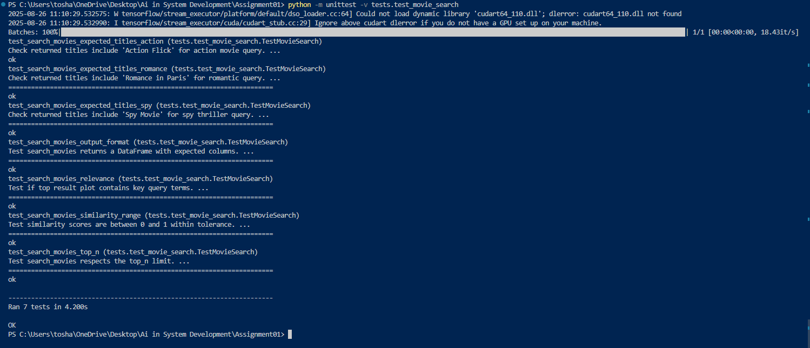

# 🎬 Movie Semantic Search Engine Roll no 221020456-Toshan kanwar


> **A powerful semantic search engine for movie plots using SentenceTransformers and cosine similarity matching.**

This repository contains my comprehensive solution for the AI Systems Development semantic search assignment. The system uses state-of-the-art sentence embeddings to find movies based on plot similarity rather than simple keyword matching, enabling intelligent content discovery through natural language queries.

---


## 🚀 Features

- **🧠 Semantic Understanding**: Uses `all-MiniLM-L6-v2` transformer model for deep plot comprehension
- **⚡ Fast Similarity Search**: Cosine similarity matching with pre-computed embeddings
- **🔍 Flexible Queries**: Natural language search support (e.g., "romantic movie in Paris")
- **📊 Similarity Scoring**: Returns confidence scores for result ranking
- **🧪 Comprehensive Testing**: 7 unit tests covering functionality, edge cases, and expected behavior
- **🛡️ Robust Error Handling**: Validates inputs, handles missing files, and provides clear error messages
- **📈 Scalable Architecture**: Modular design supporting easy dataset expansion

---

## 📂 Project Structure

movie-search-assignment/
├── movie_search.py # Main semantic search module
├── movies.csv # Sample movie dataset
├── requirements.txt # Python dependencies
├── tests/
│ ├── init.py
│ └── test_movie_search.py # Comprehensive unit tests
├── screenshots/ # Demo images and results
├── README.md # This file
└── LICENSE # MIT License


---

## ⚙️ Setup Instructions

### Prerequisites
- **Python 3.9+** ([Download here](https://www.python.org/downloads/))
- **Git** ([Download here](https://git-scm.com/downloads))

### 1. Clone Repository
```bash
git clone https://github.com/toshankanwar/Ai-In-System-Development-221020456
cd Ai-In-System-Development-221020456
```

### 2. Install Dependencies
```bash
pip install -r requirements.txt
```

---

## 🧪 Testing Instructions

### Run All Tests
```bash
python -m unittest -v tests.test_movie_search
```

---

## 💻 Usage Examples

### Basic Usage
from movie_search import load_movies, search_movies

load_movies('movies.csv')
results = search_movies('spy thriller in Paris', top_n=3)
print(results)


---

## 🤝 Contributing

1. **Fork** the repository
2. **Create** a feature branch (`git checkout -b feature/amazing-feature`)
3. **Commit** your changes (`git commit -m 'Add amazing feature'`)
4. **Push** to the branch (`git push origin feature/amazing-feature`)
5. **Open** a Pull Request

### Contribution Guidelines
- Add unit tests for new features
- Update documentation for API changes
- Follow existing code style conventions
- Ensure all tests pass before submitting

---

## 📝 Assignment Requirements Checklist

- ✅ **Semantic search implementation** using SentenceTransformers
- ✅ **all-MiniLM-L6-v2 model** integration
- ✅ **DataFrame output** with title, plot, similarity columns
- ✅ **Cosine similarity** ranking algorithm
- ✅ **Unit test suite** (7 comprehensive tests)
- ✅ **Error handling** for edge cases
- ✅ **Clean code architecture** with documentation
- ✅ **GitHub repository** with proper structure
- ✅ **README documentation** (this file)

---

## 🐛 Known Issues & Limitations

- **GPU acceleration** not implemented (CPU-only inference)
- **Large datasets** may require memory optimization
- **Model download** happens on first run (~90MB)
- **Case sensitivity** in exact movie title matching

---

## 📚 References & Documentation

- [SentenceTransformers Documentation](https://www.sbert.net/)
- [all-MiniLM-L6-v2 Model Card](https://huggingface.co/sentence-transformers/all-MiniLM-L6-v2)
- [Cosine Similarity Explanation](https://en.wikipedia.org/wiki/Cosine_similarity)
- [Python unittest Documentation](https://docs.python.org/3/library/unittest.html)

---

## 📄 License

This project is licensed under the **MIT License** - see the [LICENSE](LICENSE.txt) file for details.

---

## 👨‍💻 Contact Information

**Developer**: Toshan Kanwar
**Student ID**: [221020456]  
**University**: IIIT Naya Raipur  
**Course**: AI Systems Development  
**Assignment**: Semantic Search Engine (Assignment 1)

### 📧 Get in Touch
- **Email**: contact@toshankanwar.website
- **LinkedIn**: [https://www.linkedin.com/in/toshan-kanwar-4683a1349/](https://www.linkedin.com/in/toshan-kanwar-4683a1349/)
- **GitHub**: [@toshankanwar](https://github.com/toshankanwar)
- **Portfolio**: [https://toshankanwar.website](https://toshankanwar.website)

### 🎓 Academic Information
- **Submission Date**: August 26, 2025
- **Instructor**: https://github.com/srinidhi151
- **Assignment Deadline**: August 26, 2025, 11:59 PM IST

---

## ⭐ Acknowledgments

- **Hugging Face** for the excellent SentenceTransformers library
- **IIIT Naya Raipur** AI Systems Development course materials
- **Open Source Community** for inspiration and best practices
- **Course Instructor** for guidance and assignment specifications

---

<div align="center">

**If you found this project helpful, please consider giving it a ⭐!**

*Built with ❤️ for AI Systems Development @ IIIT Naya Raipur*

</div>
